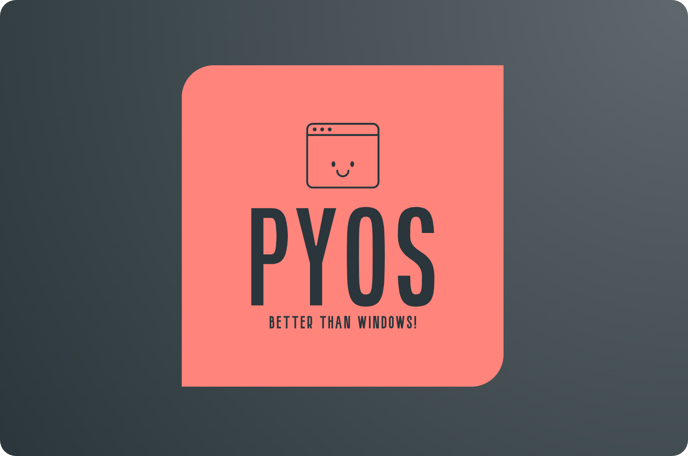

<h1 align="center">
  <a href="#"></a>
  <br><br>
  PyOS
  <br>
</h1>

<h4 align="center">An OS written in Python, built to explore academic concepts through real-world implementation.</h4>

## Story

This project started as a small side experiment developed during my free time. I was keen to implement the academic concepts taught in college — such as Operating System fundamentals, process management, file handling, and user interaction — into a real-world, hands-on project.  

The goal of **PyOS** is to build something fun, simple, and interactive while learning how real operating systems function internally. It continues to evolve as a lightweight platform that demonstrates how theory meets practice in system design.

## Features

Get ready for...

- An interactive command-line interface with customizable color support for a dynamic experience.  
- An authentication system with password hashing to ensure basic security for your files.  
- Ability to add your own commands with minimal lines of code.  
- Minimal setup requirements to get started quickly.  
- Lightweight, extensible design that makes experimenting easy and enjoyable.

## Default Login

Default credentials:  
- **Username:** root  
- **Password:** root  

## Development

The OS will continue to be developed as time allows, with a focus on exploring more core OS features and improving overall functionality.  
Please feel free to open an issue if you encounter any problems or have suggestions. Pull requests for improvements are welcome as well.

## Installation And Running

If you wish to try it out, follow the steps below to install and run **PyOS**:

```shell
echo "Installing PyOS..."
git clone https://github.com/yourusername/pyos.git
cd PyOS/
pip3 install -r requirements.txt
python3 pyos.py
